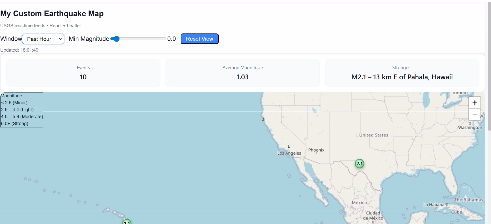

# 🌍 Earthquake Visualizer

A React + Vite application to visualize recent earthquakes on an interactive map using **Leaflet** and **USGS Earthquake API**.  

Live Demo: [Click Here](https://fjldjv-5173.csb.app/)  
## 🎥 Demo Video

Watch the demo of the Earthquake Visualizer here:

[](https://drive.google.com/file/d/1Hi19wzUWYSpO8hnvexsA9MWEkwmfyhK1/view?usp=sharing)


## 🚀 Features
- Fetches **real-time earthquake data** from [USGS](https://earthquake.usgs.gov/earthquakes/feed/v1.0/geojson.php).  
- Interactive **Leaflet Map** with zoom and pan.  
- **Clustered Markers** for dense regions.  
- Popup showing details:  
  - Magnitude  
  - Location  
  - Depth  
  - Time  
  - USGS link  


## 📂 Project Setup

### 1. Clone the repo
```bash
git clone https://github.com/shilpan16/earthquake-visualizer.git
cd earthquake-visualizer
````

### 2. Install dependencies

```bash
npm install
```

### 3. Run locally

```bash
npm run dev
```

## 🛠️ Tech Stack

* **React + Vite**
* **Leaflet + React-Leaflet**
* **react-leaflet-cluster**
* **JavaScript (ES6+)**
## 📸 Screenshot

Here is the Earthquake Visualizer in action:



## 📦 Deployment

Deployed free on **CodeSandbox**.
👉 [Live App](https://fjldjv-5173.csb.app/)


## 👩‍💻 Author

**Shilpa Neralla**

* GitHub: [@shilpan16](https://github.com/shilpan16)
* LinkedIn: https://www.linkedin.com/in/shilpa-neralla/


